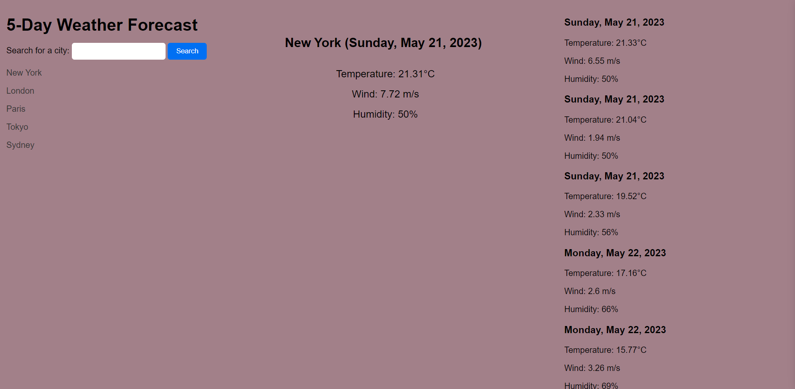

# Weather Dashboard

## Description

This is a Weather Dashboard App built using JavaScript and the Open Weather API. The user can search and see weather conditions for different cities for today and four days in the future.

Made for the Week 6 Challenge of the UM Coding Bootcamp.

## Screenshoot

## Link

You can see the deployed app here:

- https://spereira15.github.io/weather-dashboard/

